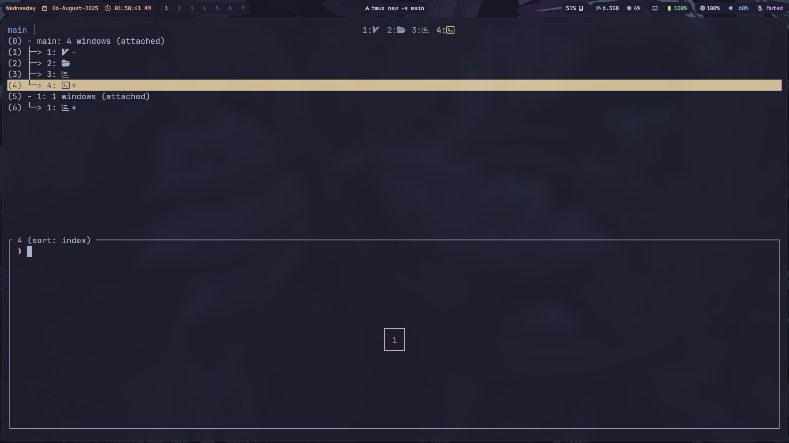

# Tmux Configuration

Minimal and fast `tmux` setup tailored for development.  
The goal: clean visuals, practical keybindings, and perfect integration with Neovim and terminal workflows.

---

## 🎯 Features

- Catppuccin Mocha theme
- Orange highlight for active session
- Unified look with Neovim lualine
- Centralized session name
- Mouse support
- Scrollback enabled
- Clean separators
- Simple, readable status bar

---

## 🖼 Preview



---

## 🧩 Plugins

Powered by [Tmux Plugin Manager (TPM)](https://github.com/tmux-plugins/tpm)

Included:
- `tmux-plugins/tmux-sensible`
- `tmux-plugins/tmux-resurrect`
- `tmux-plugins/tmux-continuum`
- `catppuccin/tmux`

---

## ⚙️ Keybindings

| Action                   | Keybind             |
| ------------------------ | ------------------- |
| Prefix key               | `Ctrl + b`          |
| Reload config            | `Prefix + r`        |
| New session              | `Prefix + s`        |
| Detach from session      | `Prefix + d`        |
| Split pane horizontally  | `Prefix + -`        |
| Split pane vertically    | `Prefix + \|`       |
| Toggle last session      | `Prefix + l`        |
| Reload all plugins       | `Prefix + I`        |
| Save session (resurrect) | `Prefix + Ctrl + s` |
| Restore session          | `Prefix + Ctrl + r` |

---

## 🎨 Theming

Using **Catppuccin Mocha** flavor.

- Orange active session highlight
- Transparent, clean borders
- Neovim statusline and tmux status bar are visually synced

Set to match with:
- `lualine` in Neovim
- `Waybar` for workspace

---

## 🖱️ Mouse and Scroll

- Mouse is enabled
- Scrollback with `Shift + Mouse Wheel` or `Prefix + [` + scroll

---

## 📂 Structure

```
~/.config/tmux/
├── tmux.conf         # Main config
├── theme.conf        # Catppuccin theme
├── plugins/          # TPM plugins (after install)
```

---

## 📦 Installation

1. Clone the config:
```bash
git clone https://github.com/EpicFailure-afk/tmux.git ~/.config/tmux
```

2. Symlink `.tmux.conf`:

```bash
ln -sf ~/.config/tmux/tmux.conf ~/.tmux.conf
```

3. Install TPM:

```bash
git clone https://github.com/tmux-plugins/tpm ~/.tmux/plugins/tpm
```

4. Launch tmux and install plugins:

```bash
tmux
# then press: Prefix + I
```

---

## 🔁 Optional

To auto-start last session:

```bash
tmux start-server
tmux new-session -d -s default
tmux attach-session -t default
```

Or use:

```bash
tmuxinator
```

---

## 🤝 Contribute

Fork it. Modify it. Use it.


